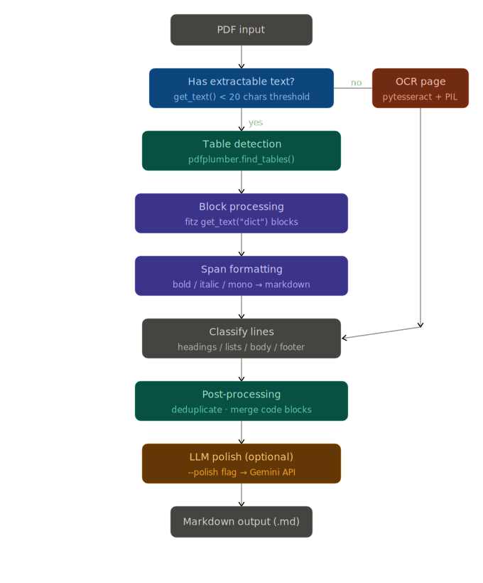
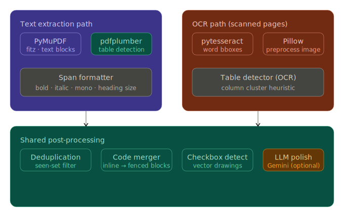

# pdf-to-markdown

Converts PDF files to clean, structured Markdown from the command line. Handles both native text PDFs and scanned image PDFs via OCR fallback. Supports tables, headings, bold/italic/monospace formatting, checkboxes, code blocks, and cross-page table continuation.

---

## Table of contents

- [Requirements](#requirements)
- [Installation](#installation)
- [Usage](#usage)
- [How it works](#how-it-works)
- [Configuration](#configuration)
- [Limitations](#limitations)
- [Samples](#samples)

---

## Requirements

| Requirement | Notes |
|---|---|
| Python 3.9+ | |
| Tesseract OCR binary | Must be installed separately and available on `PATH` |
| `pymupdf` | Imported as `fitz` |
| `pdfplumber` | Used for table detection on text PDFs |
| `pytesseract` | Python wrapper for Tesseract |
| `Pillow` | Image preprocessing before OCR |
| `google-generativeai` | Optional — only needed for `--polish` |

### Install Tesseract

**Ubuntu / Debian**
```
sudo apt install tesseract-ocr
```

**macOS**
```
brew install tesseract
```

**Windows**

Download the installer from the [UB Mannheim Tesseract releases](https://github.com/UB-Mannheim/tesseract/wiki) and add the install directory to your `PATH`.

---

## Installation

```
pip install pymupdf pdfplumber pytesseract Pillow
```

For LLM polish support:

```
pip install google-generativeai
```

No package setup or virtual environment is required, though one is recommended.

---

## Usage

### Basic conversion

```
python app.py input.pdf output.md
```

### With LLM polish

Runs an additional Gemini API pass to fix OCR artifacts, broken tables, and formatting issues.

```
python app.py input.pdf output.md --polish
```

This requires a `GEMINI_API_KEY` environment variable to be set. How you set it depends on your OS:

**macOS / Linux**
```
export GEMINI_API_KEY=your_key_here
```

**Windows (Command Prompt)**
```
set GEMINI_API_KEY=your_key_here
```

**Windows (PowerShell)**
```
$env:GEMINI_API_KEY = "your_key_here"
```

If the key is missing or `google-generativeai` is not installed, the polish step is skipped with a warning and the raw conversion output is written instead.

---

## How it works

<table><tr>
<td align="center" width="50%"><strong>System flow</strong><br/><br/></td>
<td align="center" width="50%"><strong>Library map</strong><br/><br/></td>
</tr></table>

The converter processes each page independently, then merges everything into a single Markdown file.

### Page routing

For each page, PyMuPDF's `get_text()` is called. If the result is fewer than 20 characters, the page is treated as a scanned image and sent to the OCR path. Otherwise the text extraction path runs.

### Text extraction path

Uses PyMuPDF to read text as a structured dictionary of blocks, lines, and spans. Each span carries font metadata (size, flags, font name) used for all formatting decisions.

<table>
<tr>
<td valign="top" align="center" width="24">
  <div>🔵</div>
  <div>│</div>
  <div>│</div>
  <div>│</div>
  <div>🔵</div>
  <div>│</div>
  <div>│</div>
  <div>│</div>
  <div>🔵</div>
</td>
<td valign="top">
  <br/>
  <strong>Pass 1 — orphan merging</strong><br/>
  List markers that appear alone on a line (a lone <code>•</code>, <code>-</code>, digit, etc.) are merged with the line that follows them.
  <br/><br/><br/>
  <strong>Pass 2 — paragraph merging and list detection</strong><br/>
  Lines of similar font size are merged into paragraphs unless the current line starts with a list marker. Code lines are never merged with adjacent lines.
  <br/><br/><br/>
  <strong>Pass 3 — classification and formatting</strong><br/>
  Each merged item is classified as:
</td>
</tr>
</table>

| Classification | Detection method |
|---|---|
| H1 heading | Font size >= largest font on page × 0.95 |
| H2 heading | Font size >= body size × 1.4 |
| H3 heading | Font size >= body size × 1.15 |
| Checkbox item | Vector rectangle drawings detected on the page |
| Numbered list | Line starts with `\d+[.)]` pattern |
| Bullet list | Line starts with `•`, `-`, `‣`, `◦`, `·` |
| Footer (dropped) | Y position > 90% of page height and small font |
| Body text | Everything else |

Tables are detected separately via pdfplumber and rendered as Markdown pipe tables. Text blocks that overlap a detected table bounding box are skipped to avoid duplication.

### OCR path

Used for scanned or image-only pages.

| Step | Detail |
|---|---|
| Render | Page rendered at 300 DPI via PyMuPDF |
| Preprocess | Grayscale → contrast boost (2×) → binarize at threshold 140 |
| Extract | Tesseract returns word-level bounding boxes |
| Row grouping | Words within 15px vertically are grouped into the same row |
| Table detection | Rows with 3+ word clusters separated by 100px+ gaps are table rows; at least 3 consecutive such rows required |
| Table rendering | Table rows → Markdown pipe table; remaining rows → prose |
| Cleanup | `ocr_cleanup()` applies checkbox normalization, numbered heading detection, common OCR artifact fixes, and broken-line merging |

### Post-processing

Applied to all pages after extraction:

| Step | What it does |
|---|---|
| Deduplication | Repeated blocks (e.g. headers/footers that repeat across pages) are removed using a seen-set |
| Code block merging | Consecutive lines that are predominantly inline code (>50% of chars in backtick spans) are collapsed into a fenced block; language is auto-detected from the first line |
| Cross-page table continuation | If a table at the bottom of one page (past 85% of page height) matches the column count of the first table on the next page, the continuation rows are appended without repeating the header |

### LLM polish (optional)

When `--polish` is passed, the full Markdown output is sent to Gemini 2.5 Flash. The prompt instructs it to fix table reconstruction, code block indentation, OCR misreads, and checkbox formatting without changing content. Documents larger than 15,000 characters are split on double-newline boundaries and processed chunk by chunk.

---

## Configuration

All values are hardcoded in the source. Relevant defaults:

| Parameter | Default | Location | Effect |
|---|---|---|---|
| Text threshold | 20 chars | `convert()` | Pages below this trigger OCR fallback |
| OCR DPI | 300 | `ocr_page()` | Render resolution for scanned pages |
| Contrast enhancement | 2.0× | `ocr_page()` | Pillow contrast boost before binarization |
| Binarization threshold | 140 | `ocr_page()` | Pixel cutoff for black/white conversion |
| Footer Y threshold | 90% page height | `is_footer()` | Lines below this are candidates for dropping |
| Footer size threshold | body_size × 0.95 | `is_footer()` | Small text in footer zone is dropped |
| OCR table min rows | 3 consecutive | `ocr_page()` | Fewer matching rows → not classified as a table |
| OCR word row gap | 15px | `ocr_page()` | Max vertical distance to be on the same row |
| OCR column gap | 100px | `ocr_page()` | Min horizontal gap between table columns |
| Cross-page table threshold | 85% page height | `process_blocks()` | A table must reach this Y position to be eligible for continuation |
| LLM chunk size | 15,000 chars | `llm_polish()` | Max characters per Gemini API call |
| Gemini model | `gemini-2.5-flash` | `llm_polish()` | Model used for the polish pass |

---

## Limitations

### General

- **Multi-column layouts are not handled.** Text in a two-column layout will be extracted in the order PyMuPDF encounters it, which typically interleaves the columns.

- **Figures and diagrams are ignored.** Embedded images, charts, and illustrations are not extracted or described. Only vector drawings used as checkboxes are inspected.

- **Footnotes are dropped.** The footer filter discards small text near the bottom of the page. Legitimate footnote content is lost along with page numbers.

- **Mathematical formulas are not rendered.** Equations may appear as garbled characters. There is no LaTeX or MathML output.

- **Right-to-left text is not supported.** Arabic, Hebrew, and other RTL scripts will likely extract in the wrong order.

### Text extraction path

- **Bold/italic detection is heuristic.** It relies on font names containing words like `bold` or `italic` and on PDF font flags. Non-standard font names will not be detected.

- **Heading size detection is relative to the document.** The thresholds (1.15×, 1.4×, 0.95× of body size) are fixed multipliers. Documents where all text is the same size will produce no headings, or too many.

- **Code detection is based on font name.** A span is treated as monospace if its font name contains `mono`, `courier`, or `code`. Custom monospace fonts under other names are not detected.

- **Cross-page table merging uses column count only.** Two unrelated tables on successive pages with the same column count will be incorrectly merged.

### OCR path

- **Quality depends on the source scan.** Low resolution, skew, staining, or handwriting will degrade accuracy. The preprocessing steps help but cannot fix fundamentally poor input.

- **Table detection is approximate.** The cluster heuristic works on word spacing. Narrow columns, merged cells, or uneven spacing may cause misclassification.

- **Formatting is not recovered.** All OCR text is treated as plain body text or section headings detected by numbered prefixes. Bold, italic, and font sizes from the original scan are lost.

- **The LLM polish pass can introduce errors.** Gemini is instructed not to alter content, but hallucination is possible on damaged or ambiguous OCR output. Review the output carefully when using `--polish` on critical documents.

### Performance

- **Large scanned documents are slow.** OCR at 300 DPI is CPU-intensive. The LLM polish pass adds additional latency and API cost proportional to document length.

- **Memory scales with document size.** All Markdown lines accumulate in memory before the file is written. Very large PDFs may require significant RAM.

---

## Samples

The `stress_tests/` directory contains PDFs and their converted outputs used during development.

### Text extraction (non-OCR)

These are native text PDFs — the standard extraction path runs on them.

| PDF | Output (raw) | Output (with `--polish`) |
|---|---|---|
| [case1.pdf](stress_tests/nonOCR/case1.pdf) | [case1.md](stress_tests/nonOCR/case1.md) | [case1_with_llm.md](stress_tests/nonOCR/case1_with_llm.md) |
| [case2.pdf](stress_tests/nonOCR/case2.pdf) | [case2.md](stress_tests/nonOCR/case2.md) | [case2_with_llm.md](stress_tests/nonOCR/case2_with_llm.md) |
| [case3.pdf](stress_tests/nonOCR/case3.pdf) | [case3.md](stress_tests/nonOCR/case3.md) | [case3_with_llm.md](stress_tests/nonOCR/case3_with_llm.md) |
| [case4.pdf](stress_tests/nonOCR/case4.pdf) | [case4.md](stress_tests/nonOCR/case4.md) | [case4_with_llm.md](stress_tests/nonOCR/case4_with_llm.md) |
| [case5.pdf](stress_tests/nonOCR/case5.pdf) | [case5.md](stress_tests/nonOCR/case5.md) | [case5_with_llm.md](stress_tests/nonOCR/case5_with_llm.md) |
| [case6.pdf](stress_tests/nonOCR/case6.pdf) | [case6.md](stress_tests/nonOCR/case6.md) | [case6_with_llm.md](stress_tests/nonOCR/case6_with_llm.md) |
| [converter_stress_test.pdf](stress_tests/nonOCR/converter_stress_test.pdf) | [converter_stress_test.md](stress_tests/nonOCR/converter_stress_test.md) | [converter_stress_test_with_llm.md](stress_tests/nonOCR/converter_stress_test_with_llm.md) |
| [converter_stress_test_v2.pdf](stress_tests/nonOCR/converter_stress_test_v2.pdf) | [converter_stress_test_v2.md](stress_tests/nonOCR/converter_stress_test_v2.md) | [converter_stress_test_v2_with_llm.md](stress_tests/nonOCR/converter_stress_test_v2_with_llm.md) |

### OCR path

These are scanned image PDFs — pages with fewer than 20 characters of extractable text go through Tesseract.

| PDF | Output (raw) | Output (with `--polish`) |
|---|---|---|
| [CamScanner case1.pdf](<stress_tests/OCR/CamScanner case1.pdf>) | [CamScanner case1.md](<stress_tests/OCR/CamScanner case1.md>) | [CamScanner case1_with_llm.md](<stress_tests/OCR/CamScanner case1_with_llm.md>) |
